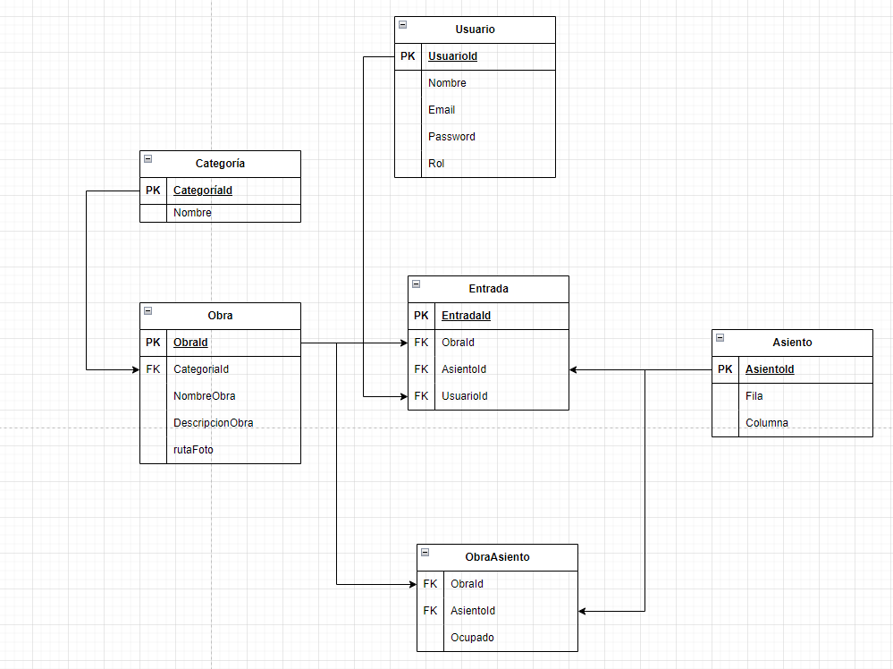

# APITeatro

## Índice
1. [Diagrama BBDD](#diagrama-bbdd)
2. [Comandos utilizados para crear el proyecto](#comandos-utilizados-para-crear-el-proyecto)

## Diagrama BBDD




## Comandos utilizados para crear el proyecto

```plaintext
dotnet new sln -n TeatroApi

dotnet new classlib -n TeatroApi.Models -o Models 
dotnet sln add ./Models/TeatroApi.Models.csproj 
dotnet build ./Models/TeatroApi.Models.csproj

dotnet new classlib -n TeatroApi.Business -o Business 
dotnet sln add ./Business/TeatroApi.Business.csproj 
dotnet build ./Business/TeatroApi.Business.csproj

dotnet new classlib -n TeatroApi.Data -o Data 
dotnet sln add ./Data/TeatroApi.Data.csproj 
dotnet build ./Data/TeatroApi.Data.csproj

dotnet new webapi -n TeatroApi.Api -o Api 
dotnet sln add ./Api/TeatroApi.Api.csproj 
dotnet build ./Api/TeatroApi.Api.csproj

dotnet add ./Business/TeatroApi.Business.csproj reference ./Models/TeatroApi.Models.csproj

dotnet add ./Api/TeatroApi.Api.csproj reference ./Business/TeatroApi.Business.csproj

dotnet add ./Business/TeatroApi.Business.csproj reference ./Data/TeatroApi.Data.csproj

dotnet add ./Data/TeatroApi.Data.csproj reference ./Models/TeatroApi.Models.csproj

```


## Comandos utilizados para dockerizar
```plaintext
docker-compose up --build --force-recreate -d

docker-compose down -v

dotnet ef migrations remove  -p ./Data/TeatroApi.Data.csproj -s ./Api/TeatroApi.Api.csproj

dotnet tool install --global dotnet-ef --version 6.*

dotnet ef migrations add Actualizacion3 -p ./Data/TeatroApi.Data.csproj -s ./Api/TeatroApi.Api.csproj

dotnet ef database update  -p ./Data/TeatroApi.Data.csproj -s ./Api/TeatroApi.Api.csproj
```