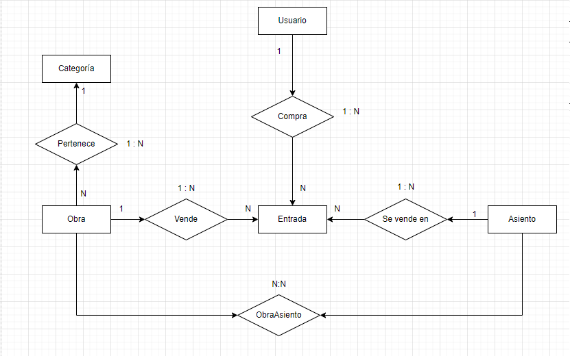

# APITeatro

## Diagrama BBDD

## Comandos proyecto

### Crear proyecto de clase para Models en .NET 6
dotnet new classlib -n learnApi.Models -o Models --framework net6.0

### Agregar el proyecto de Models a la solución
dotnet sln add ./Models/learnApi.Models.csproj

### Compilar el proyecto de Models
dotnet build ./Models/learnApi.Models.csproj

### Crear proyecto de clase para Services en .NET 6
dotnet new classlib -n learnApi.Services -o Services --framework net6.0

### Agregar el proyecto de Services a la solución
dotnet sln add ./Services/learnApi.Services.csproj

### Compilar el proyecto de Services
dotnet build ./Services/learnApi.Services.csproj

### Crear proyecto de clase para Data en .NET 6
dotnet new classlib -n learnApi.Data -o Data --framework net6.0

### Agregar el proyecto de Data a la solución
dotnet sln add ./Data/learnApi.Data.csproj

### Compilar el proyecto de Data
dotnet build ./Data/learnApi.Data.csproj

### Crear proyecto de Web API en .NET 6
dotnet new webapi -n learnApi.Api -o Api --framework net6.0

### Agregar el proyecto de Api a la solución
dotnet sln add ./Api/learnApi.Api.csproj

### Compilar el proyecto de Api
dotnet build ./Api/learnApi.Api.csproj

### Agregar referencias entre proyectos
dotnet add ./Services/learnApi.Services.csproj reference ./Models/learnApi.Models.csproj
dotnet add ./Api/learnApi.Api.csproj reference ./Services/learnApi.Services.csproj
dotnet add ./Services/learnApi.Services.csproj reference ./Data/learnApi.Data.csproj
dotnet add ./Data/learnApi.Data.csproj reference ./Models/learnApi.Models.csproj

dotnet ef migrations add InitialCreate -p ./Data/learnApi.Data.csproj -s ./Api/learnApi.Api.csproj
